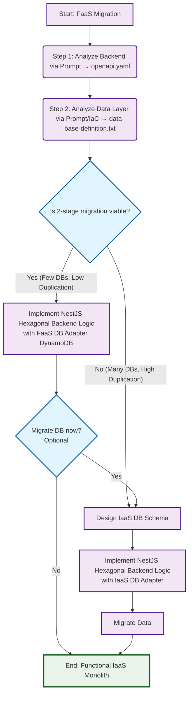

# FaaS-to-IaaS Migration Framework

This diagram shows the decision flow for migrating FaaS applications to monolithic IaaS architecture.

## Framework Diagram



## Flow Description

### 🔍 **Analysis Phase**

1. **Analyze Backend**: Generate OpenAPI specification from FaaS code
2. **Analyze Data**: Document database structure from IaC and code

### 🤔 **Strategic Decision Point**

**Is a 2-stage migration viable?**

- **Criteria for YES**: Few databases, low data duplication
- **Criteria for NO**: Many databases, high duplication/complexity

### 🛤️ **Two Migration Paths**

#### **Path 1: 2-Stage Migration** 🟢

- **Advantages**: Lower initial risk, incremental migration
- **Process**:
  1. Implement NestJS backend with adapters for existing DB (e.g., DynamoDB)
  2. **Optional decision**: Migrate DB later by reusing unified path steps

#### **Path 2: Unified Migration** 🔴

- **Advantages**: Final architecture from the start, better for complex cases
- **Process**:
  1. Design IaaS DB schema
  2. Implement NestJS backend with IaaS DB adapters
  3. Migrate data directly

### 🎯 **Final Result**

Both paths converge to: **Functional IaaS Monolith**

## Application Example: PetStore

The PetStore project followed the **2-Stage Path** because:

- ✅ Only 2 DynamoDB tables (few databases)
- ✅ Simple structure without complex duplication (low duplication)
- ✅ Clear relationships (franchise → stores)
- ✅ Benefit of fast delivery with lower initial risk

### 2-Stage Implementation:

**Stage 1: NestJS Backend + DynamoDB**

- Immediate backend migration to NestJS with Hexagonal Architecture
- DynamoDB adapters keep existing database working
- Fast delivery of functional IaaS monolith
- Risk reduction by not changing DB and backend simultaneously

**Stage 2: Database Migration (Optional/Future)**

- If IaaS DB becomes necessary (e.g., complex queries, SQL tools)
- Only requires changing database adapters (~5-7 days work)
- 85% of code remains unchanged thanks to Hexagonal Architecture
- Controlled and predictable migration

## NestJS Hexagonal Architecture

Both paths implement **Hexagonal Architecture (Ports and Adapters)**:

```
┌─────────────────────────────────────────┐
│             NestJS Application          │
│  ┌─────────────────────────────────────┐ │
│  │        Business Logic Core         │ │
│  │     (Domain Services & Entities)    │ │
│  └─────────────────────────────────────┘ │
│              ▲              ▲            │
│              │              │            │
│         ┌────────┐     ┌──────────┐      │
│         │  HTTP  │     │Database  │      │
│         │  Port  │     │   Port   │      │
│         └────────┘     └──────────┘      │
└─────────────────────────────────────────┘
              ▲              ▲
              │              │
    ┌─────────────┐    ┌─────────────┐
    │    REST     │    │  Database   │
    │   Adapter   │    │   Adapter   │
    │(Controllers)│    │(DynamoDB/SQL/│
    └─────────────┘    │  MongoDB)   │
                       └─────────────┘
```

This architecture allows easy switching between database adapters (DynamoDB ↔ PostgreSQL ↔ MongoDB) without affecting business logic.

## Framework Benefits

### 🎯 **Decision Support**

- **Clear criteria** for choosing migration strategy
- **Risk assessment** based on database complexity
- **Flexible approach** allowing phased or unified migration

### 🏗️ **Implementation Guidance**

- **Hexagonal Architecture** ensures clean separation of concerns
- **Adapter pattern** enables database technology changes
- **Incremental approach** reduces migration risks

### 📊 **Validation Process**

- **API analysis** through OpenAPI specification generation
- **Database assessment** through IaC and code analysis
- **Informed decision making** based on complexity metrics

This framework provides a systematic approach to FaaS-to-IaaS migration, reducing complexity and ensuring architectural quality in the resulting monolithic application.
