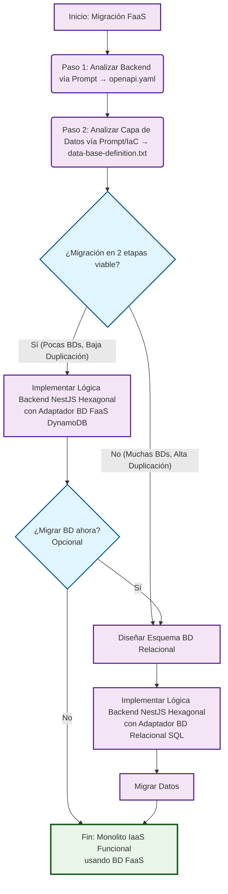

# Framework de Migración FaaS-to-IaaS

Este diagrama muestra el flujo de decisión para migrar aplicaciones FaaS a arquitectura IaaS monolítica.

## Diagrama del Framework



## Descripción del Flujo

### 🔍 **Fase de Análisis**
1. **Analizar Backend**: Generar especificación OpenAPI desde el código FaaS
2. **Analizar Datos**: Documentar estructura de base de datos desde IaC y código

### 🤔 **Punto de Decisión Estratégica**
**¿Es viable una migración en 2 etapas?**
- **Criterios para SÍ**: Pocas bases de datos, baja duplicación de datos
- **Criterios para NO**: Muchas bases de datos, alta duplicación/complejidad

### 🛤️ **Dos Caminos de Migración**

#### **Camino 1: Migración de 2 Etapas** 🟢
- **Ventajas**: Menor riesgo inicial, migración incremental
- **Proceso**:
  1. Implementar backend NestJS con adaptadores para BD existente (ej: DynamoDB)
  2. **Decisión opcional**: Migrar BD más tarde reutilizando pasos del camino unificado

#### **Camino 2: Migración Unificada** 🔴  
- **Ventajas**: Arquitectura final desde el inicio, mejor para casos complejos
- **Proceso**:
  1. Diseñar esquema de BD relacional
  2. Implementar backend NestJS con adaptadores SQL
  3. Migrar datos directamente

### 🎯 **Resultado Final**
Ambos caminos convergen en: **Monolito IaaS Funcional**

## Ejemplo de Aplicación: PetStore

En el proyecto PetStore se siguió el **Camino Unificado** porque:
- ✅ Solo 2 tablas DynamoDB (estructura simple)
- ✅ Relaciones claras (franchise → stores)
- ✅ No hay duplicación compleja de datos
- ✅ Beneficio inmediato de BD relacional

## Arquitectura NestJS Hexagonal

Ambos caminos implementan la **Arquitectura Hexagonal (Ports and Adapters)**:

```
┌─────────────────────────────────────────┐
│             NestJS Application          │
│  ┌─────────────────────────────────────┐ │
│  │        Business Logic Core         │ │
│  │     (Domain Services & Entities)    │ │
│  └─────────────────────────────────────┘ │
│              ▲              ▲            │
│              │              │            │
│         ┌────────┐     ┌──────────┐      │
│         │  HTTP  │     │Database  │      │
│         │  Port  │     │   Port   │      │
│         └────────┘     └──────────┘      │
└─────────────────────────────────────────┘
              ▲              ▲
              │              │
    ┌─────────────┐    ┌─────────────┐
    │    REST     │    │  Database   │
    │   Adapter   │    │   Adapter   │
    │(Controllers)│    │(DynamoDB/SQL)│
    └─────────────┘    └─────────────┘
```

Esta arquitectura permite cambiar fácilmente entre adaptadores de base de datos (DynamoDB ↔ PostgreSQL) sin afectar la lógica de negocio.